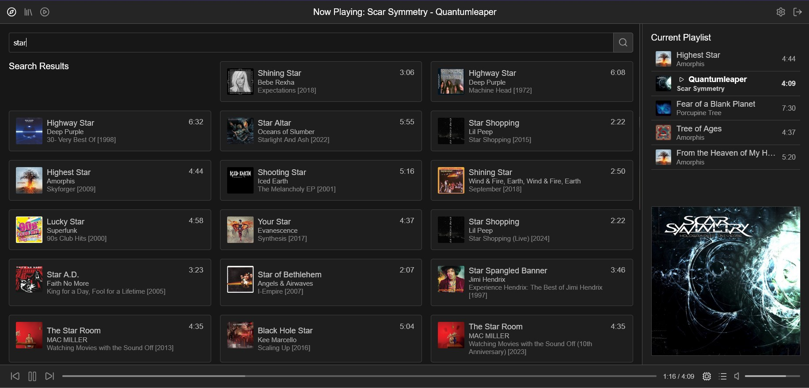

# Beat Lemon
**A private music streaming plattform**

Warning: This Project is Work In Progess/Unfinished!

This app can be used to host a private music library for streaming on a VPS.
It consists of a FastAPI/Python backend (for scanning/managing/streaming files) and a frontend implemented with JS, CSS and HTML.

## Features
- Continous playback with auto DJ (using jaccard-index of genres, release year difference and album name to determine similarity)
- Loudness normalization (tagging in backend, gain applied in frontend, no re-transcoding necessary)
- Wikicrawler and LastFM integration for better tagging
- UI Color Sliders for Themeing
- Genre "Radios"

## GUI Screenshot

